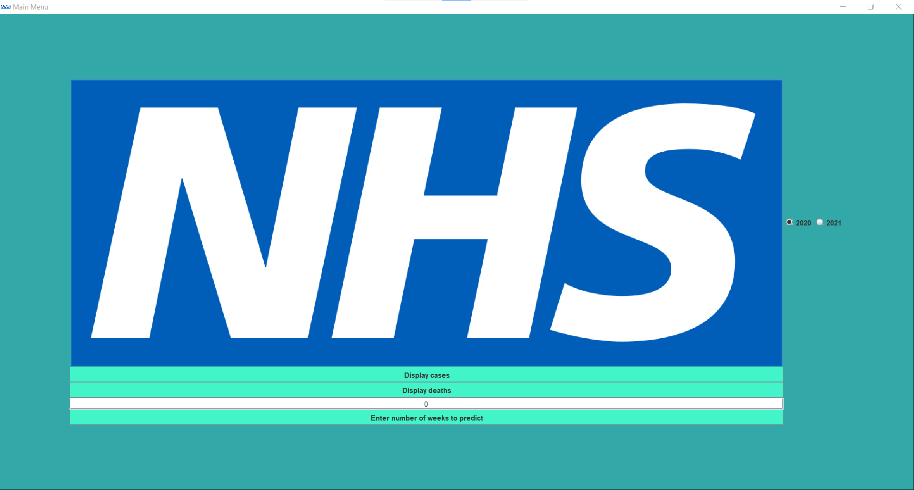
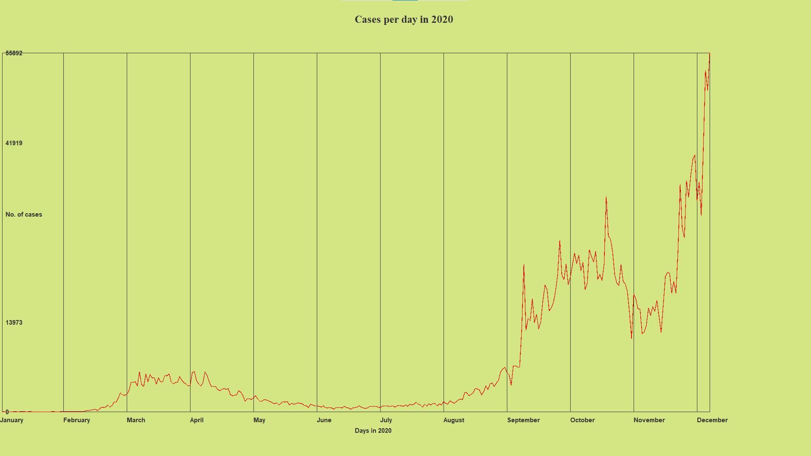
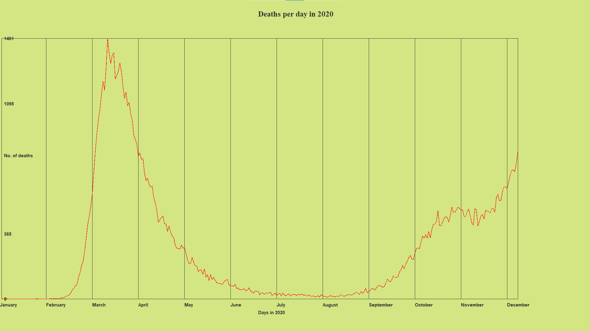
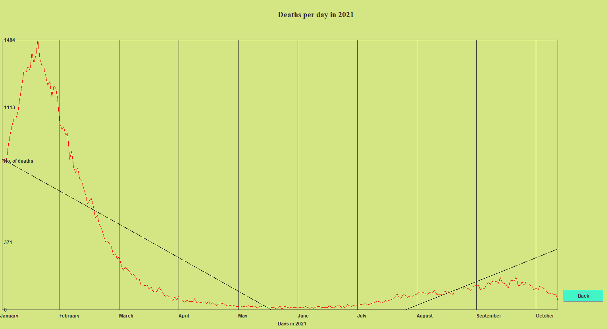
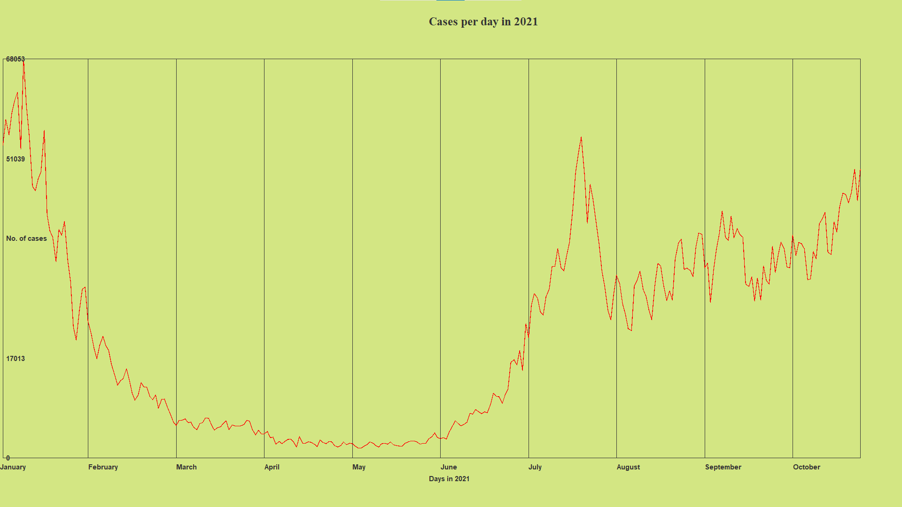
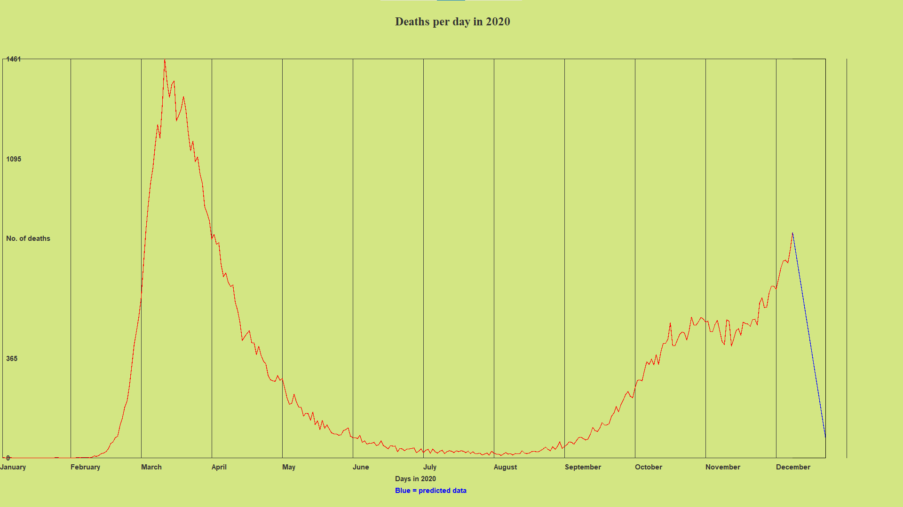
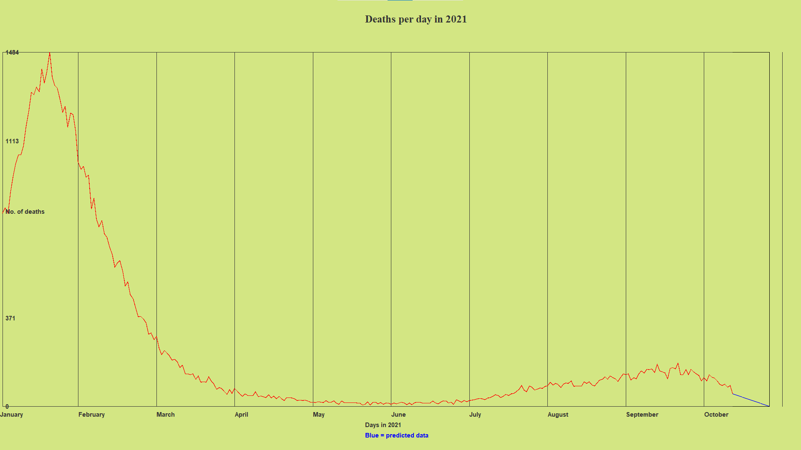
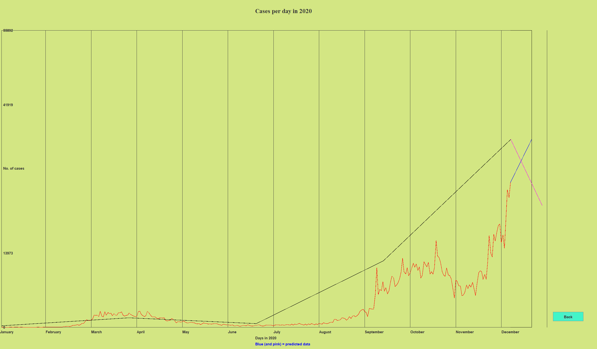

# A COVID-19 modeling and forecast tool
# Contents of product demonstration
* [Product information](product-information)
* [Main menu](#main-menu)
* [Sample data](#sample-data)
* [Incomplete features](#incomplete-features)

# Product Information
*This is a covid tool that is being to used analyse the deaths and infections by COVID-19. This is largely significant, for key economic agents within the UK such as the Government. This is because, it gives them to opportunity to take part in relevant preparations to ensure the NHS/healthcare system can deal with demand levels.*

# Main Menu Screenshot
  
This is the main menu where a user can input sample data to predict how many weeks they plan to see in the future, in order to best prepare for future covid infectionds and deaths.

# Sample Data Section
**No weeks predicted (cases) 2020:**

**No weeks predicted (deaths):**

**No weeks predicted (deaths for 2021):**

**No weeks predicted (cases for 2021):**

Here is a screenshot of a user inputting 2 weeks to predict how many infections and deaths there is going to be.

The user after this would be able to see how many deaths and infections there is going to be in 2020 (with 2 weeks in the future)
Here is the graph the user would be expected to see if they click display deaths:

As you can see this is deaths per day in 2020 when the user inputs 2 weeks.

**Here is what it looks like if the user inputs in the same number of weeks for 2021:**

# Incomplete Features
In relation to what is left to be finished functional wise is the back button. This is important, so the user can scroll back and forth between pages if using the product as a presentation for example. Furthermore, this is important because at the moment the user has to click on the windows button and manually come back to intellij to stop the programme from still running.

*Since this document's creation, this back button has been implemented and piecewise linear regression has been properly implemented, here is a screenshot of the linear pieces and a 2-week prediction*  

