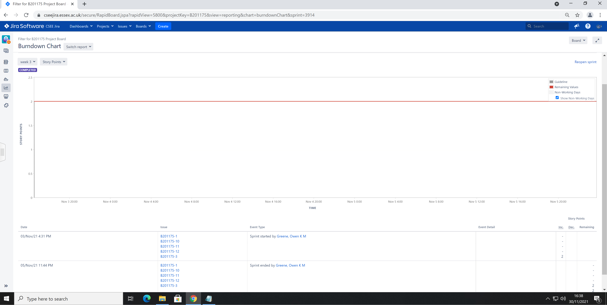
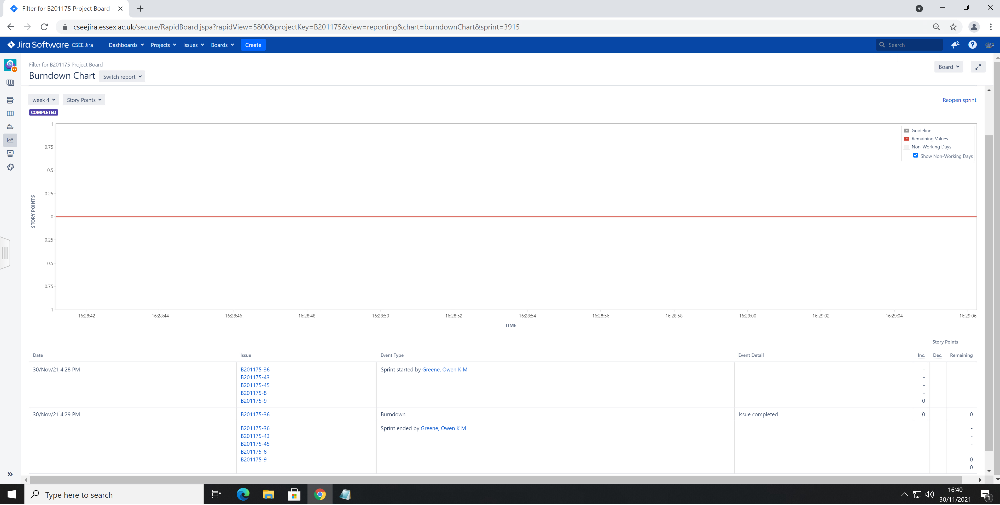
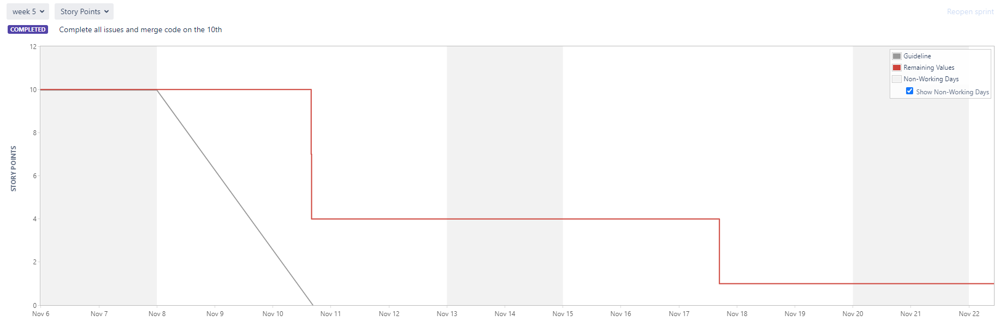
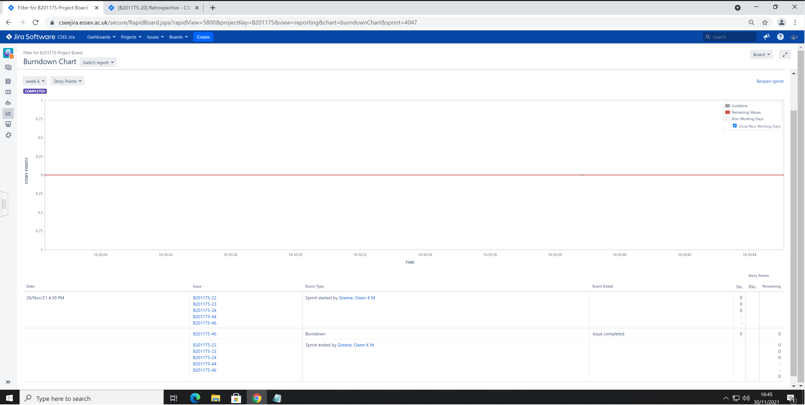
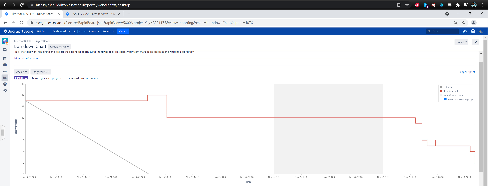
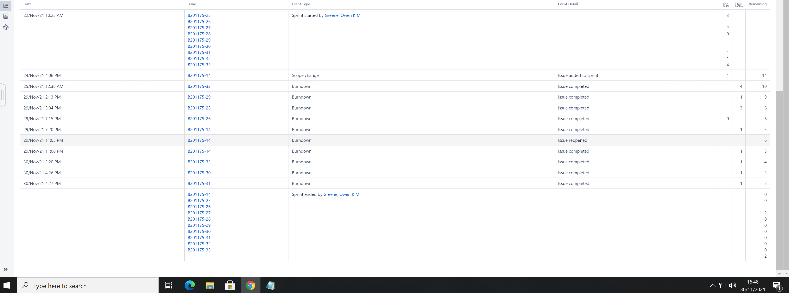
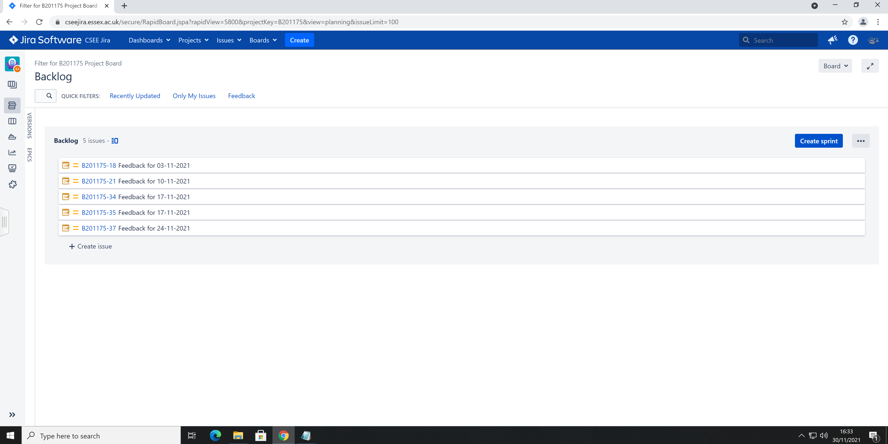

# Project Management Log

## Project management discussion

Overall, the way the group has worked together has been somewhat fragmented, but a decent MVP was able to be created. The scrum meetings were not particularly effective as many sessions members would not be present and therefore unable to contribute to the scrum retrospectives or overall discussions. They could be more efficient if a reasonable amount of time was consistently dedicated to them each week and if we had consistent attendance.  

In terms of communication issues, due to missing members, information discussed and agreed upon during the labs had to be repeated in a WhatsApp group which led to confusion and inefficiency. Sprints were also often unable to be closed and new ones started as 1 or 2 issues would still be open from a previous sprint and had to be closed manually with no resolution. We were however able to create a fully featured codebase, and the final product is both functional and should be easy to add on additional features to.

## Sprint Burndown Charts
### Sprint 1 (Weeks 3+4)

Week 3 burndown chart  

Week 4 burndown chart  

### Sprint 2 (Weeks 5+6)

Week 5 burndown chart

Week 6 burndown chart  

Retrospective for sprint 2: https://cseejira.essex.ac.uk/projects/B201175/issues/B201175-20

### Sprint 3 (Weeks 7+8+9)

Week 7+8 burndown chart  

Week 7+8 issues
## Burndown-Charts Discussion
Since people were not using the story points and in progress features properly, all of our charts look very strange save for sprint 3. In the future, all group members would be aware of how these features worked from the start and therefore the charts would look much better.

## Product Backlog

Current backlog
