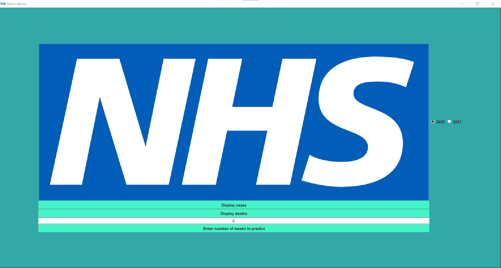

## Table of Contents
1. [Project outline](#Project outline)
2. [Technologies](#technologies)
3. [Installation](#installation)
4. [Usage](#usage)
### Project outline
***
This project aims to create a program that will display Covid-19 data from the NHS website graphically and use modelling to predict how the data will look in the next set amount of time.

## Technologies
***
A list of technologies used within the project:
* [Java standard library](https://docs.oracle.com/javase/7/docs/api/): Version 7
* [JDK 16](https://www.oracle.com/java/technologies/javase/jdk16-archive-downloads.html)
* [IntelliJ](https://www.jetbrains.com/idea/)
## Installation
***
How to install the software
```
$ Clone this repository (or download as a zip and extract) https://cseegit.essex.ac.uk/21-22-ce201-col/21-22_CE201-col_team32.git
You will need a correct username and password to clone this
$ Run the JAR file in the root directory
```

## Usage
***
To use this software simply run the JAR file.  

First, the user will need to log in to the program. Different users have different permissions pertaining to what they can and cannot do with the program. Passwords are encrypted using a hashing function. The credentials for the root user are as follows:

```
First name: Owen
Last name: Greene
Password: lol
```

Once logged in, you can enter a number of weeks to predict into the future and then select a year using the radio buttons on the
side of the main menu.  

Once this is done, you can then click either the button pertaining to cases or deaths, causing the program to show a graph with collected data in red and predicted data in pink (if any).  
Assuming the user has permissions to view predictions, if 0 is entered as the number of weeks to predict, then the graph will only contain collected data (red) with no predicted data (this is the default behaviour). The user can also select either 2021 or 2020 using the radio buttons to change the year of data that gets displayed.
Further clarity on these features is found in the ProductDemonstration.md file.
***

# Main Menu
