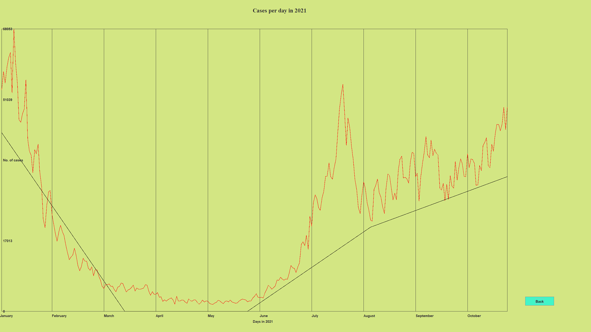

# Product Demonstration

## **CONTENTS**

## Product information

This is a COVID-19 tool to analyse deaths, infections and to create their prediction. This is largely significant, for key economic agents within the UK such as the Government. This is because, it gives them to opportunity to take part in relevant preparations to ensure the NHS/healthcare system can deal with demand levels.

## Login PAGE &amp; MAIN MENU

This is the log in page of the application. Here the users can log in to access the main menu. There will be different types of users that will have different action permissions.

In case the log in credentials are incorrect, or the user is yet to be added to the database, there will be displayed a message that he is not in the database.

Click OK in order to retry entering the details. After correct data has been inserted, click on enter and it will take you to the Main Menu.

In the picture below we will see the Main Menu of an administrator that has full access to any generation, forecasting and user creation.

## MAIN MENU, USERS AND GENERATION

1.Users&#39;s Main Menu and Access

After accessing the main menu, the users will have different options depending on their given access.
 An administrator has full access and his menu will look like the picture below.

Meanwhile a person that can only see a graph will only have access to this menu.

Let&#39;s start with the generation of the graph that this user has access to. He can decide the graph he wants generated (cases/deaths) and the year by choosing one of the options on the right side of the menu:

If we wish to see the cases in 2020 we click on the year 2020 and then on display cases. The following graph will be generated:

As you can also see in the image above, there is a back button, which helps the user return to the main menu if clicked on.
 If we want to see the death cases in 2021 we can access it by clicking on 2021 option and then the &#39;display deaths&#39; actions.

Let&#39;s get to a more advanced user actions, such as the administrator.
 Apart from having the access to display cases/deaths in a given year, the administrator also has the ability to generate a forecast in a number given of weeks.
 Firstly insert the number of weeks you want to forecast as shown in the picture below:

Enter the number you wish to generate here and then click on the option below the number:

After that choose the desired year and what graph to generate(Cases/deaths)
 In the following example we will see a forecast of 6 weeks, cases graph in 2021 generated by the administrator:

Another option that the administrator has is by creating new users. If the administrator clicks on the last option he will be able to add a new user.

After clicking on that option he will be prompted to the following screens.

Choose the first name, last name and the password and click ok, after each one in order to get to the action permissions.

After deciding the users credentials, you can give him access to the following:

The final option is the one that makes a user an administrator.

