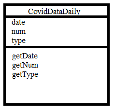

# Team Implementation Report
## Technical Diagrams
  

Here is an example of one of our classes
## Technical Description
The software was designed to be modular and incremental from the beginning in order to allow us go back
and change things if they no longer fit with the vision of the product. The code follows an object-oriented design pattern, as is customary in our chosen language of Java, with classes being used to describe
large chunks of functionality, such as getting data from a particular source and drawing out different gui windows, so as to make it easier to
work on individual portions of the code at a time. Inheritance is not used as it would not make sense to do so for our use case. Instead, we make use of an enum to distinguish between the 2 different types of Covid data JavaDocs is used throughout the program to give clear and precise method descriptions
that can also be integrated into one's IDE directly. Contained in the src folder are all the Java source files and classes.  

The most important classes are those responsible for processing data and drawing a clean gui to the user, these being DrawGui
, DrawTimeScaleGraphs,LoginGui and GuiMain. DrawTimeScaleGraphs is the most important of these as it is responsible for processing data
provided by CovidDataDaily as well as displaying it in graphical form to the user. The code to draw the graphs is handwritten using
swing and JFrames which scales the point to fit on the users screen resolution and also uses piecewise linear regression to make predictions about
where the data will go in the future.

## Algorithms and Data Structures
One data structure that was used in the program fairly heavily was Java ArrayLists, primarily to store data from the CSV files. They have a lookup time of O(1) or O(n) in the worst case if the array needs to be copied. All other operations are O(n) in the worst case and the data structure itself has space complexity of O(n).  

One algorithm that was used was linear regression, which has a running time of O(n) and a space complexity of O(n) in memory during operation. Linear regression is used to extrapolate new values for Y for a given X value, given a set of data for X and Y. This allows us to make naive predictions about where the data will go in the future.

## Imported Libraries 
Libraries are found in resources/libraries and contain the following:  
``commons-lang3-3.8.1.jar ``   
``commons-logging-1.2.jar  ``  
``hsqldb-2.5.0.jar  ``  
``jackcess-3.0.1.jar  ``  
``ucanaccess-5.0.1.jar  ``  
Are all used for making a connection to an SQL database and executing queries on it.

``junit-4.13.2.jar``  
Is used for unit testing.

## Known Issues
Clicking cancel when adding a new user can lead to exceptions with null data being passed to sql statements