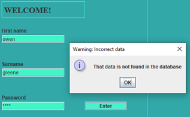

Test Plan

| Test Number | Test Name | Test description | Test desired outcome | evidence |
| --- | --- | --- | --- | --- |
| 1 | Login successful | Test correct login details | Taken onto main menu | screenshot |
| 2 | Login Failed – incorrect password | Test incorrect password but valid username | Login Failed | screenshot |
| 3 | Login Failed – incorrect username | Test incorrect username with a valid password | Login Failed | screenshot |
| 4 | Login Failed – nothing entered | Test with no details given | Login Failed | screenshot |
| 5 | Load 2020 covid case data | Attempt to load data | Data is displayed to user | Screenshot |
| 6 | Load 2020 covid death data | Attempt to load data | Data is displayed to user | Screenshot |
| 7 | Load 2021 covid case data | Attempt to load data | Data is displayed to user | screenshot |
| 8 | Load 2021 covid death data | Attempt to load data | Data is displayed to user | Screenshot |
| 9 | Load 2020 covid case piece-wise regression | Attempt to load data | Data is displayed to user | Screenshot |
| 10 | Load 2020 covid death piece-wise regression | Attempt to load data | Data is displayed to user | Screenshot |
| 11 | Load 2021 covid case piece-wise regression | Attempt to load data | Data is displayed to user | Screenshot |
| 12 | Load 2021 covid death piece-wise regression | Attempt to load data | Data is displayed to user | screenshot |
| 13 | Add user successful | Adds a normal user to the database | User addition succeeds | screenshot |
| 14 | Add empty user | Attempts to user with no details to database | User addition fails | screenshot |
| 15 | Add repeat User | Add a user with the same details as an already entered user | User addition fails | screenshot |
| 16 | Check regression prediction line is shown | Check if the regression line is present and accurate | Regression line is shown | screenshot |

Test Results -

| Test Number | Test Name | Test outcome | Evidence | Pass/ Fail |
| --- | --- | --- | --- | --- |
| 1 | Login successful | Takes you to home menu |  | Pass |
| 2 | Login Failed – incorrect password | Login Failed |  | Pass |
| 3 | Login Failed – incorrect username | Login Failed |  | Pass |
| 4 | Login Failed – nothing entered | Login Failed |  | Pass |
| 5 | Load 2020 covid case data | Data Loaded |  | Pass |
| 6 | Load 2020 covid death data | Data Loaded |  | Pass |
| 7 | Load 2021 covid case data | Data Loaded |  | Pass |
| 8 | Load 2021 covid death data | Data Loaded |  | Pass |
| 9 | Load 2020 covid case piece-wise regression | Data Loaded |  | Pass |
| 10 | Load 2020 covid death piece-wise regression | Data Loaded |  | Pass |
| 11 | Load 2021 covid case piece-wise regression | Data Loaded |  | Pass |
| 12 | Load 2021 covid death piece-wise regression | Data Loaded |  | Pass |
| 13 | Add user successful | User is successfully added |  | Pass |
| 14 | Add empty user | User is successfully added when it shouldn't |  | Fail |
| 15 | Add repeat user | User is successfully added when it shouldn't |  | Fail |
| 16 | Check regression prediction line is shown | regression prediction line is present and is accurate |  | Pass |

Junit testing –

We have implemented some Junit tests that could be automatically run if this project were to be integrated with an automation server such as Jenkins so that we could be more confident new patches were working if we were to deploy an actual production version of this program. We didn&#39;t originally factor in Junit tests into our planning and as such we had a lot of integration and entanglement between front end and back-end making it difficult to junit test all of our program.

In the future if we were to redo this project we would try to distinguish the front and back end more clearly so that more of the code can be tested, increasing our safety as a project.

getCovidCasesFromCsvNoLocation() – checks that getCovidCasesFromCsv() throws a FileNotFoundException if nofile path is entered

getCovidCasesFromCsvWorks() - checks that getCovidCasesFromCsv() runs correctly and transforms the data if a valid file path is input

getDeathsCasesFromCsvNoLocation() – checks that getCovidDeathsFromCsv() throws a FileNotFoundException if nofile path is entered

getDeathsCasesFromCsvWorks() - checks that getDeathsCasesFromCsv() runs correctly and transforms the data if a valid file path is input

LinearRegressionAccuracyTest() – checks that the linearRegression produces the correct results

All of these tests pass.