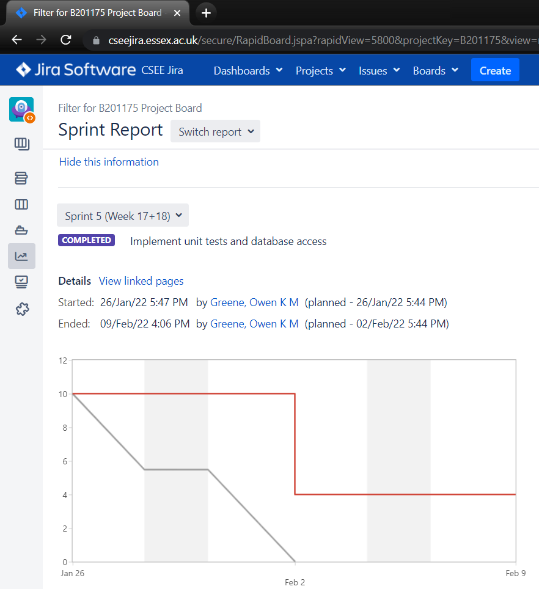
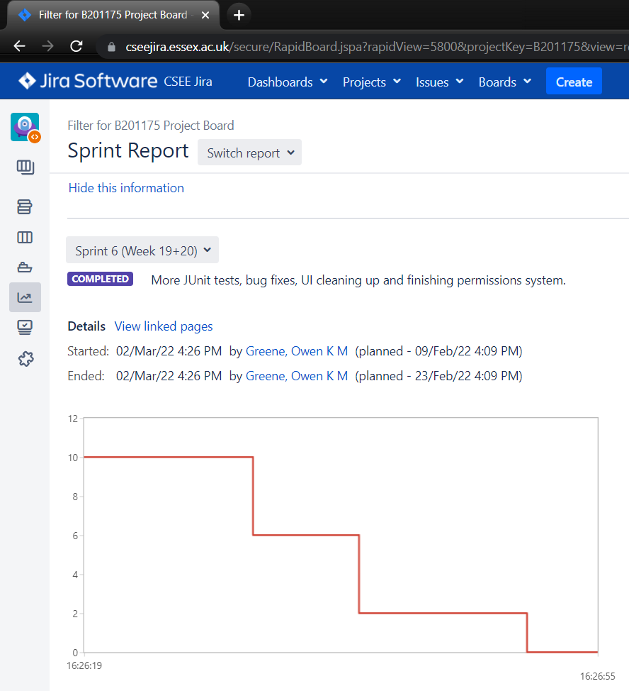

# Project Management Log

## Project management discussion

Overall, the way the group has worked together has been somewhat fragmented, but we were able to complete all the functionality we desired in the given time frame. The scrum meetings were not particularly effective as many sessions members would not be present and therefore unable to contribute to the scrum retrospectives or overall discussions. They could be more efficient if a reasonable amount of time was consistently dedicated to them each week and if we had consistent attendance.
In terms of communication issues, due to missing members, information discussed and agreed upon during the labs had to be repeated in text form which led to confusion and inefficiency. Sprints were also often unable to be closed and new ones started as 1 or 2 issues would still be open from a previous sprint and had to be closed manually with no resolution (this issue was particularly difficult to work around as Jira is only accessible via being physically on campus or through horizon which was frequently down, and when not down, was instead completely unusable due to heavy lag and input delay). We were however able to create a fully featured codebase, and the final product is both functional and should be easy to add on additional features to.

## Sprint Burndown Charts

### Sprint 5
  

### Sprint 6

  
## Burndown-Charts Discussion
Since people were not using the story points and in progress features properly, all of our charts look very strange save for sprint 3. In the future, all group members would be aware of how these features worked from the start and therefore the charts would look much better.

## Product Backlog
*Include here a screenshot of your current product backlog.*